# Domain Driven Design

## 1. Linguagem Obiqua
| Termo                 | Significado                                                                         |
|----------------------|--------------------------------------------------------------------------------------|
| Cliente              | Pessoa que realiza o pedido pelo totem de autoatendimento.                           |
| Pedido               | Requisição de um ou mais itens feita por um cliente.                                 |
| Produto              | Item do Pedido  selecionado pelo cliente (lanche, acompanhamento, bebida, sobremesa).|
| Combo                | Conjunto de itens escolhidos pelo cliente.                                           |
| Checkout             | Etapa final do pedido, onde ocorre o pagamento.                                      |
| Cozinha              | Setor responsável pela preparação dos pedidos.                                       |
| Painel do Cliente    | Tela de acompanhamento que mostra o status dos pedidos.                              |
| Painel Administrativo| Interface para gerenciamento de produtos, categorias e pedidos.                      |
| Categoria            | Classificação do item: Lanche, Acompanhamento, Bebida, Sobremesa.                    |
| QR Code Mercado Pago | Meio de pagamento utilizado para finalizar o pedido.                                 |
| **Loja**              | Estabelecimento responsável pela venda de produtos alimentícios.                    |

## 2. Event Storming

### 2.1 Fluxo: Realização do Pedido e Pagamento

#### Comandos:
- IniciarPedido  
- AdicionarItemAoPedido  
- RemoverItemDoPedido  
- IdentificarCliente  
- FinalizarPedido  
- RealizarPagamento  

#### Eventos:
- PedidoIniciado  
- ItemAdicionado  
- ItemRemovido  
- ClienteIdentificado  
- PedidoFinalizado  
- PagamentoRealizado  

#### Entidades:
- Cliente  
- Pedido  
- ItemDoPedido  

#### Aggregates:
- **Pedido** (gerencia estado do combo e validações de pagamento)

#### Regras de Negócio:
- Um pedido pode ter de 0 a N itens.  
- Só é possível finalizar um pedido se houver pelo menos um item.  
- O pagamento é feito via **QR Code Mercado Pago** e deve ser validado antes do envio para a cozinha.

### 2.2 Fluxo: Preparação e Entrega do Pedido

#### Comandos:
- EnviarPedidoParaCozinha  
- AtualizarStatusDoPedido  
- NotificarCliente  
- FinalizarEntrega  

#### Eventos:
- PedidoEnviadoParaCozinha  
- StatusDoPedidoAtualizado  
- ClienteNotificado  
- PedidoFinalizado  

#### Entidades:
- Pedido  
- Cozinha  

#### Status do Pedido:
- Recebido  
- Em Preparação  
- Pronto  
- Finalizado  

#### Regras de Negócio:
- O pedido deve ser exibido no painel do cliente imediatamente após confirmação do pagamento.  
- A mudança de status deve ocorrer em tempo real.  
- O cliente deve ser notificado quando o pedido estiver pronto.

## 2.3 Diagramas

### Realização do Pedido e Pagamento

```mermaid
    graph LR
        A[Iniciar Pedido] --> B[Pedido Iniciado]
        B --> C[Adicionar Item ao Pedido]
        C --> D[Item Adicionado]
        D --> E[Identificar Cliente]
        E --> F[Cliente Identificado]
        F --> G[Finalizar Pedido]
        G --> H[Pedido Finalizado]
        H --> I[Realizar Pagamento]
        I --> J[Pagamento Realizado]
```

### Preparação e Entrega do Pedido

```mermaid
    graph LR
        A[Pagamento Realizado] --> B[Enviar Pedido para Cozinha]
        B --> C[Pedido Enviado para Cozinha]
        C --> D[Atualizar Status: Em Preparação]
        D --> E[Status Atualizado: Em Preparação]
        E --> F[Atualizar Status: Pronto]
        F --> G[Status Atualizado: Pronto]
        G --> H[Notificar Cliente]
        H --> I[Cliente Notificado]
        I --> J[Finalizar Entrega]
        J --> K[Pedido Finalizado]
```
