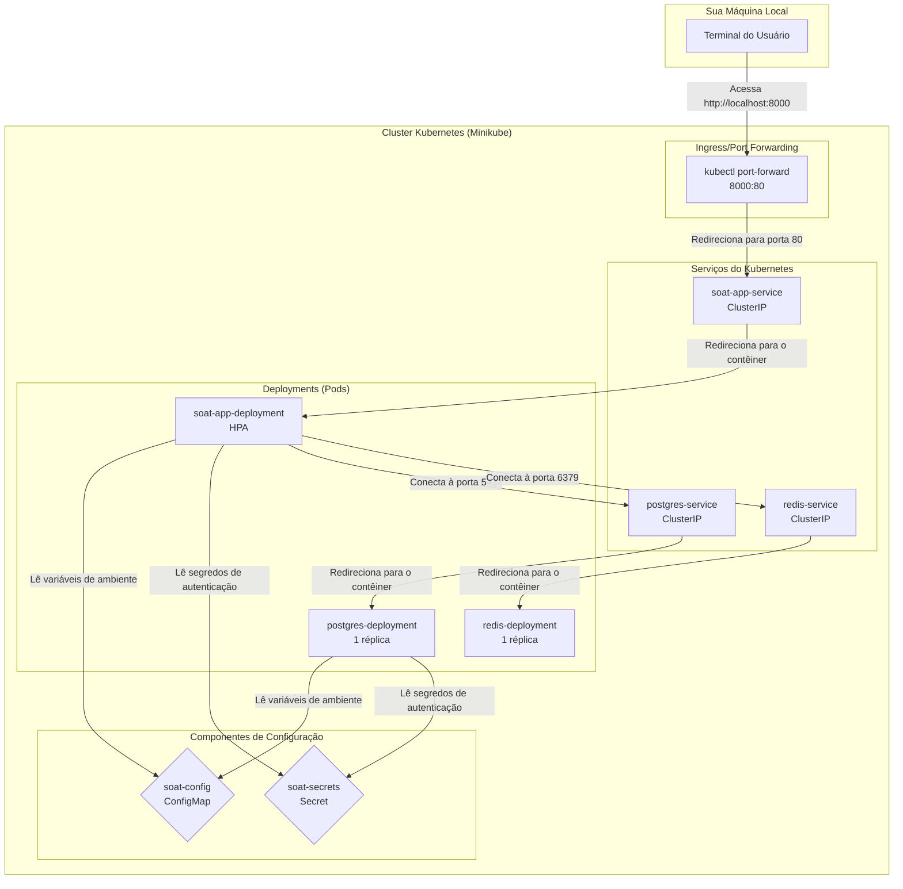

### Guia do Projeto com Kubernetes (Minikube)

Este `README.md` fornece as instruções detalhadas para executar a aplicação com Kubernetes, utilizando o Minikube como ambiente local.

#### 1\. Arquitetura da Solução

A arquitetura da solução é baseada em microsserviços rodando em um cluster Kubernetes. A seguir, o diagrama visual que representa a arquitetura:

**Descrição da arquitetura:**

  * **Backend da Aplicação (`soat-app`)**: É um `Deployment` que executa a aplicação Laravel. A escalabilidade é gerenciada por um `HorizontalPodAutoscaler` (HPA) que ajusta o número de pods com base no uso da CPU para lidar com a demanda.
  * **Serviço de Banco de Dados (`postgres-deployment`)**: Um `Deployment` que executa um banco de dados PostgreSQL. As credenciais de acesso são fornecidas de forma segura através de um `Secret` do Kubernetes.
  * **Serviço de Cache (`redis-deployment`)**: Um `Deployment` de um único pod que executa uma instância do Redis para gerenciamento de cache.
  * **Serviços (`soat-app-service`, `postgres-service`, `redis-service`)**: Objetos `Service` do Kubernetes que gerenciam a comunicação entre os pods. O `soat-app-service` é usado para expor a aplicação.
  * **Configurações e Segredos**: Valores sensíveis, como senhas, são armazenados em um `Secret` (`soat-secrets`). Já configurações não sensíveis, como nomes de usuários e de banco de dados, são armazenadas em um `ConfigMap` (`soat-config`).

#### 2\. Pré-requisitos

Para executar o projeto, você precisa ter as seguintes ferramentas instaladas:

  * **Docker**: Para construir a imagem da aplicação.
  * **Minikube**: Para rodar o cluster Kubernetes localmente.
  * **kubectl**: A ferramenta de linha de comando do Kubernetes.

#### 3\. Guia de Execução

Siga os passos do README.MD 

#### 4\. Demonstração e Documentação

Para a entrega da documentação, inclua um vídeo no YouTube ou Vimeo que demonstre a arquitetura e o funcionamento da aplicação. O vídeo deve mostrar:

  * A implantação usando o script.
  * O acesso aos endpoints da API.
  * A visualização dos logs para provar que a aplicação está funcionando.
  * A URL para o vídeo deve ser adicionada aqui: `[Link para o vídeo]`