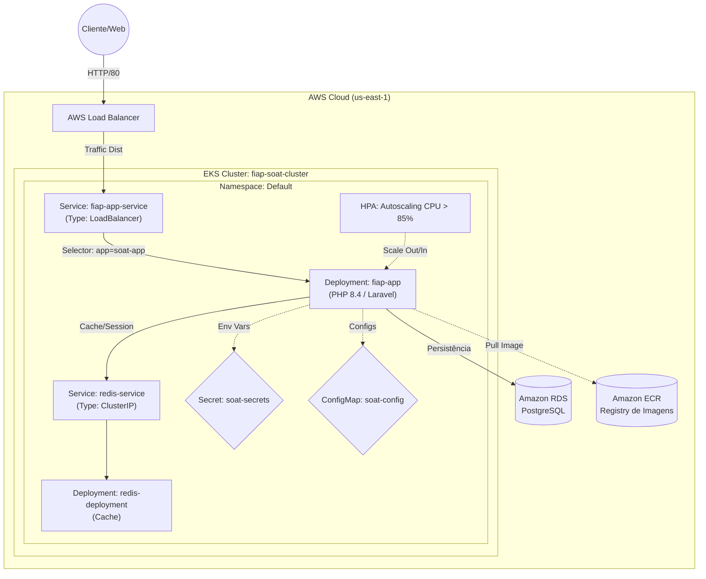

# ☸️ Arquitetura Kubernetes (AWS EKS)

Este documento detalha a topologia da aplicação rodando no cluster **Amazon Elastic Kubernetes Service (EKS)**. Diferente do ambiente de desenvolvimento (Minikube), este ambiente utiliza serviços gerenciados para garantir alta disponibilidade e escalabilidade.

## 🏗️ Diagrama da Solução


```mermaid
graph TD
    User((Cliente/Web))
    
    subgraph "AWS Cloud (us-east-1)"
        ELB[AWS Load Balancer]
        
        subgraph "EKS Cluster: fiap-soat-cluster"
            direction TB
            
            subgraph "Namespace: Default"
                SvcApp["Service: fiap-app-service<br/>(Type: LoadBalancer)"]
                SvcRedis["Service: redis-service<br/>(Type: ClusterIP)"]
                
                HPA["HPA: Autoscaling CPU > 85%"]
                
                DeployApp["Deployment: fiap-app<br/>(PHP 8.4 / Laravel)"]
                DeployRedis["Deployment: redis-deployment<br/>(Cache)"]
                
                Secret{Secret: soat-secrets}
                Config{ConfigMap: soat-config}
            end
        end
        
        RDS[("Amazon RDS<br/>PostgreSQL")]
        ECR[("Amazon ECR<br/>Registry de Imagens")]
    end

    %% Fluxo de Tráfego
    User -->|HTTP/80| ELB
    ELB -->|Traffic Dist| SvcApp
    SvcApp -->|Selector: app=soat-app| DeployApp
    
    %% Conexões Internas
    DeployApp -->|Cache/Session| SvcRedis
    SvcRedis --> DeployRedis
    
    %% Conexões Externas
    DeployApp -->|Persistência| RDS
    DeployApp -.->|Pull Image| ECR
    
    %% Configuração
    DeployApp -.->|Env Vars| Secret
    DeployApp -.->|Configs| Config
    HPA -.->|Scale Out/In| DeployApp
```

## 🧩 Componentes do Cluster

### 1. Ingress & Networking

* **Service (`fiap-app-service`):** Do tipo `LoadBalancer`. A AWS provisiona automaticamente um *Classic Load Balancer (CLB)* ou *Network Load Balancer (NLB)* para expor a aplicação para a internet na porta 80.
* **Service (`redis-service`):** Do tipo `ClusterIP`. Acessível apenas internamente pelos pods da aplicação, garantindo segurança na camada de cache.

### 2. Workloads (Aplicações)

* **Core API (`fiap-app`):**
* Gerenciado por um `Deployment`.
* **Escalabilidade:** Controlada pelo **HPA** (`HorizontalPodAutoscaler`), que monitora o uso de CPU. Se a média ultrapassar **85%**, novos pods são criados automaticamente (Min: 2, Max: 5).
* **Zero Downtime:** Configurado com `RollingUpdate` para garantir que novas versões sejam implantadas sem derrubar o serviço.


* **Redis (`redis-deployment`):**
* Mantém sessões de usuário e cache de consultas.
* Roda como um pod único (Stateful) para simplicidade neste estágio arquitetural.


### 3. Gerenciamento de Configuração

* **Secrets (`soat-secrets`):**
* Não existem no repositório de código por segurança.
* São criados **dinamicamente** pelo Pipeline de CI/CD (GitHub Actions) no momento do deploy, injetando as credenciais do RDS (criado pelo Terraform) e a chave da aplicação.


* **ConfigMap (`soat-config`):**
* Armazena variáveis não sensíveis, como configurações de timezone, debug mode e drivers de conexão.


---

## ☁️ Integração com Serviços AWS

A aplicação no Kubernetes não roda isolada; ela se conecta a recursos externos provisionados via Terraform:

| Recurso K8s | Recurso AWS | Descrição |
| --- | --- | --- |
| **Pod** | **IAM Role (Node Group)** | Os nós do cluster possuem permissão `AmazonEC2ContainerRegistryReadOnly` para baixar imagens privadas do ECR. |
| **Env Var** | **RDS Endpoint** | O Host do banco de dados é injetado via output do Terraform diretamente no Secret do Kubernetes. |
| **LoadBalancer** | **AWS ELB** | O Service do K8s cria e configura automaticamente o balanceador de carga na VPC da AWS. |

---

## 🛠️ Como interagir com o Cluster

Para desenvolvedores com acesso (via `aws eks update-kubeconfig`):

1. **Listar Pods e Status:**
```bash
kubectl get pods -o wide

```


2. **Verificar Logs da Aplicação:**
```bash
kubectl logs -f deployment/fiap-app

```


3. **Verificar Escalabilidade (HPA):**
```bash
kubectl get hpa

```

4. **Acessar o Banco de Dados (via Pod):**
Como o RDS está numa subnet privada ou restrita, a conexão deve ser feita através da aplicação ou de um *bastion host*.
